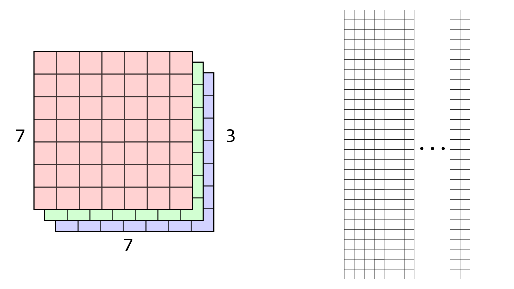

# DeepC

**DeepC** is a lightweight neural network library written in C developed as part of [Introduction to Deep Learning (CSE 599g1)](https://courses.cs.washington.edu/courses/cse599g1/18au/) course in Fall 2018. The ```src/``` subfolder contains the header and source files. ```uwnet.py``` is a wrapper function which provides a pure Python interface to our C library. ```trycifar.py``` and ```trymnist.py``` are python scripts where we load the data, define our network and run the train and test functions.

## 1. matrix

```matrix``` is the most fundamental data structure in this framework. It contains 4 variables, the number of rows and columns of the matrix, an array of floats containing data in row-major order. The ```matrix``` struct is declared in the ```matrix.h``` file. The file also declares functions to manipulate and copy matrices which are later defined in ```matrix.c```. 

## 2. data

```data``` struct is declared and defined in ```uwnet.h```. It contains the input matrix **``X``** and the output matrix **``y``** on which the neural network is trained.

## 3. activation functions

```activations.c``` defines ```activate_matrix``` and ```gradient_matrix``` for different activation function. Right now, it supports Logistic, RELU, LRELU and Softmax activation function.

### 3.1 ```activate_matrix```

It takes a matrix ```m``` and an activation function ```a```  which is a constant string and returns ```f(m)```, where ```f``` is defined by what the activation ```a``` is. ```f``` is applied elementwise to ```m```.

### 3.2 ```gradient_matrix```

Given the output of a layer i.e ```f(m)``` and the activation function ```a``` that defines ```f```, it returns ```f'(m)```.

## 4. layer

The ```layer``` struct contains the input and output of a layer. It also stores the weights and biases and has function pointers for forward propagation, backpropagation and for updating the weights and biases.

### 4.1 connected_layer 

It is a fully connected layer defined in ```connected_layer.c```. It has three functions ```forward_connected_layer```, ```backward_connected_layer``` and ```update_connected_layer```.

#### 4.1.1 forwad_connected_layer

The function outputs a matrix ```f(in*w + b)``` where: ```in``` is the input, ```w``` is the weights, ```b``` is the bias, and ```f``` is the activation function.

#### 4.1.2 backward_connected_layer

The function takes ```dL/df(in*w+b)``` (derivative of loss wrt output) as the argument and returns ```dL/dw``` (derivative of 
loss wrt layer weights), ```dL/db```(derivative of loss wrt biases) and ```dL/din``` (derivative of loss wrt to input).

#### 4.1.3 update_connected_layer

The function updates our weights and biases using SGD with momentum and weight decay.

### 4.2 convolutional_layer

```convolutional_layer.c``` defines the convolutional layer. It contains the following major functions: ```im2col```, ```col2im```, ```forward_convolutional_layer```, ```backward_convolutional_layer``` and ```update_convolutional_layer```

#### 4.2.1 im2col

It take spatial blocks of image and put them into columns of a matrix. ```Im2col``` handles kernel size, stride, padding, etc.



#### 4.2.2 col2im

It does the exact opposite of ```im2col``` restoring the image structure.

#### 4.2.3 forwad_convolutional_layer

The output of im2col is multiplied by the filter matrix, where each filter is a seperate row in the matrix in row-major order. The output matrix is then passed through ```activate_matrix``` function.


#### 4.2.4 backward_convolutional_layer

Similar to ```backward_connected_layer```, it calculates the derivative of loss wrt to weights, biases and the inputs.

#### 4.2.5 update_convolutional_layer

The function updates our weights (kernel values) and biases using SGD with momentum and weight decay.

### 4.3 maxpool_layer

Maxpooling is another core building block of convolutional neural network architecture. Implementing ```maxpool_layer``` will be similar to implementing ```convolution_layer``` in some ways, we have to iterate over the image, process a window of pixels with some fixed size, and then find the maximum value to put into the output. It is defined in```maxpool_layer.c```.

#### 4.3.1 forwad_maxpool_layer

The method finds the maximum value in a given window size, moving by some strided amount between applications. maxpooling happens on each channel independently.

#### 4.3.2 backward_maxpool_layer

The backward method is similar to forward. Even though the window size may be large, only one element contributed to the error in the prediction so we only backpropagate our deltas to a single element in the input per window. Thus, you'll iterate through again and find the maximum value and then backpropagate error to the appropriate element in ```dL/din``` corresponding to the position of the maximum element.

## 4. net

The ```net``` struct is an array of layers.

### 4.1 forward_net

This function runs forward propagation function for each layer in order they are stacked.

### 4.2 backward_net

It backpropagates the derivative of loss through each layer by calling the backpropagation function of each layer.

### 4.3 update_net

This function updates the weights and biases of all the layers in the network.

## 5. classifier

```classifier``` has ```train_image_classifier``` function that calls ```forward_net```, ```backward_net``` and ```update_net``` in that order for specified number of iterations. It also has functions to calculate cross entropy loss and accuracy of the network.


## Compile and Run

Run ```make``` to compile your source file and to make sure your executables and libraries are up to date. Then either run ```python trymnist.py``` or  ```python trycifar.py``` to train the  neural network on MNIST and CIFAR-10 data respectivey. All data resides in individual subfolders in the ```./data/``` folder.
